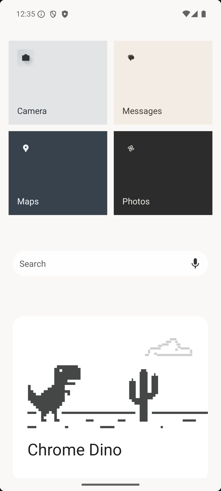
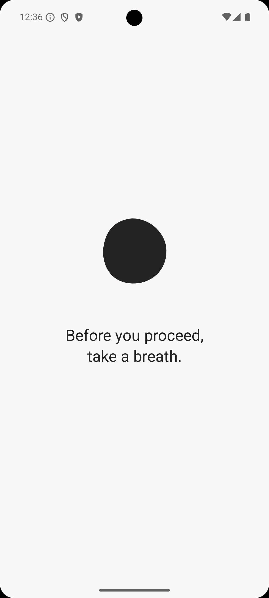
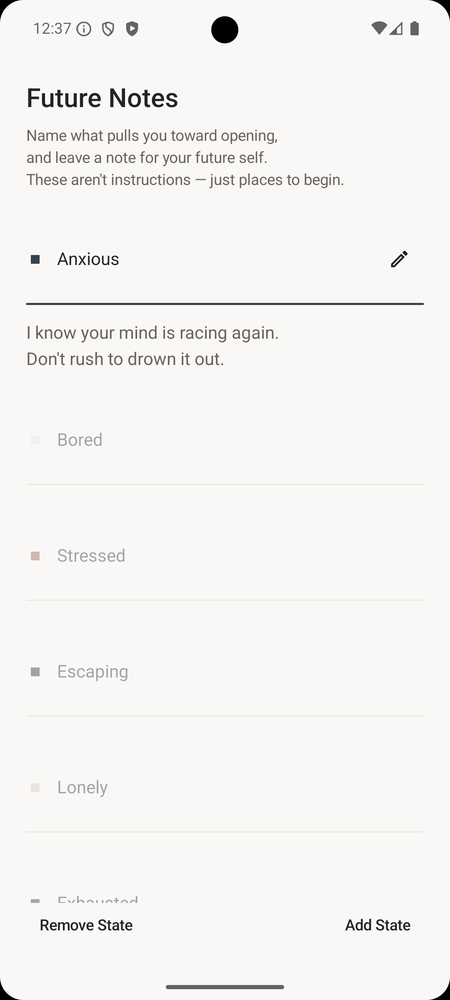

# Cairn

### A quieter way into your phone.

Cairn replaces your Android Home with a quieter space for the apps and widgets you choose.

For the apps where you want a little more intention, Cairn add a small pause before opening them — enough room to notice the choice, without taking it away.

You can still continue.

Cairn isn't there to stop you. It's there to make the choice visible again.

**[Download Cairn Public Beta →](https://github.com/Olivia-Ficus/cairn-releases/releases/tag/v0.1.0-public-beta.1)**

Android 8.0+ · Free to use · Fully offline

---

  
  &nbsp;&nbsp;
  
  &nbsp;&nbsp;
  

## What you'll find in Cairn

### A quieter Home

Cairn becomes your Android Home, with space for the apps and widgets you choose to keep nearby.

### A pause where you want one

Select an app in Settings and Cairn can place a short intentional pause before you open it from Home.

The Free plan lets you select **one app at a time**.

Future Pro plans will let you bring the same pause to as many apps as you choose.

### Future Notes

A place to leave words for your future self.

Write something now and let it return later.

### River Report

Look back at what appeared over time without turning your week into a scoreboard.

---

## Download the Public Beta

**[Download the latest Cairn Public Beta →](https://github.com/Olivia-Ficus/cairn-releases/releases/tag/v0.1.0-public-beta.1)**

The current beta is distributed here as a signed Android APK.

Cairn isn't on Google Play yet, so installation currently uses Android's sideloading flow.

If you've never installed an APK before, the steps are below.

---

## About this Public Beta

This is the first public version of Cairn.

Different Android manufacturers may behave differently, and there are parts of the experience that can only become visible once Cairn reaches more real phones.

The beta is free to use.

Google Play purchasing is not available yet.

---

## Plans

Cairn is free to use with **one app selected at a time** for the intentional pause.

When Google Play purchasing becomes available, the planned Pro options are:

- **Monthly** — $7.99 / month
- **Yearly** — $69 / year
- **Lifetime** — $149 once

Pro will let you bring the same pause to as many apps as you choose.

There is no checkout in the current Public Beta. Using the beta does not start a trial, subscription, preorder, or purchase.

---

## Nothing leaves your phone

Cairn Public Beta v1 is completely offline.

Your selected apps, settings, Future Notes and River Report stay on your device.

There are:

- no analytics
- no crash trackers
- no accounts
- no background update checks
- no usage data sent off your phone

Cairn does not request internet access in this Public Beta.

---

## Privacy

Read the [Cairn Privacy Policy](docs/privacy/index.html).

---

## A boundary worth knowing

Cairn's pause belongs to the **Cairn launcher experience**.

When you open a selected app from Cairn Home, Cairn can place that intentional pause in front of it.

Android has other ways to enter an app — for example from Recent Apps, a notification, or another launcher. Those paths can bypass Cairn.

Cairn is designed to place a choice in a familiar path, not to make the choice impossible.

---

## Install

1. Open the [**current Public Beta release**](https://github.com/Olivia-Ficus/cairn-releases/releases/tag/v0.1.0-public-beta.1).
2. Download the `.apk` file under **Assets**.
3. Open the downloaded APK on your Android phone.
4. Android may ask you to allow installation from this source. Follow the system prompt to continue.
5. Install and open Cairn.
6. Follow Cairn's onboarding to set it as your Home app when you're ready.

Android or Play Protect may show additional warnings because Cairn is currently installed outside Google Play.

Make sure the APK came from this `Olivia-Ficus/cairn-releases` repository before continuing.

---

## Updates

Cairn Public Beta does not check for updates automatically.

New beta versions will appear in this repository under **Releases**.

To update, download the newer signed APK and install it over your existing Cairn installation.

You should not need to uninstall Cairn first.

---

## Verify your download

Each Cairn release includes information that can be used to verify that the APK you downloaded is the intended release, including:

- version
- package identity
- APK SHA-256
- signing certificate SHA-256
- minimum supported Android version

See [**RELEASE_METADATA.md**](./RELEASE_METADATA.md) for the current release metadata.

---

## Known limitations

This is an early Public Beta.

In particular:

- Cairn's intentional pause applies to launches through the Cairn launcher, not every Android launch path.
- Android manufacturer differences may affect launcher behavior.
- Updates are currently manual.
- Google Play purchasing is not available yet.
- The beta does not contain analytics or automatic crash reporting, so some problems may need to be reproduced manually.

---

## Feedback

If something feels confusing, breaks on your phone, or simply makes you think *Cairn would feel better if…*, I'd like to hear it.

**[hello.cairn@proton.me](mailto:hello.cairn@proton.me)**

Bug reports, compatibility notes, small observations and product feedback are all welcome.
